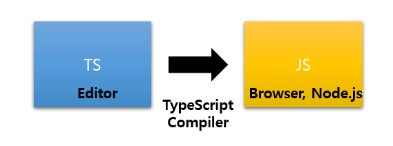

### Typed JavaScript at any Scale 

* TypeScript extends JavaScript by adding types 

  > TypeScript는 types을 추가하여 JavaScript을 확장시켜준다. 

* By understanding JavaScript, TypeScript saves you time catching errors and providing fixes before you run code. 

  > 코드를 실행하기 전에 TypeScript는 catching errors and providing fixes하는 것을 시간을 절약해 준다. 

* Any browser, any OS, anywhere JavaScript runs. 

  Entirely Open Source.

  > 어떤 브라우저나, 어떤  OS, 어떤  JavaScript를 실행하며 이것은 완전한 오픈소스이다. 

### TypeScript 

#### = Language 

#### = Typed Superset of JavaScript 

#### = compiles to plain JavaScript 

*  타입스크립트는 'Programming Language 언어'이다. 
* 타입스크립트는 'Compiled Language' 이다. 
  * 전통적인 Compiled Language와 다른 점이 많다. 
  * 따라서 **'Transpile'** 이라는 용어를 사용하기도 한다. 
* 자바스크립트는 'Interpreted Language' 이다. 

| Compiled                           | Interpreted                       |
| ---------------------------------- | --------------------------------- |
| 컴파일이 필요하다                  | 컴파일이 필요없다                 |
| 컴파일러가 필요하다                | 컴파일러가 필요없다               |
| 컴파일하는 시점 O (=> 컴파일 타임) | 컴파일하는 시점 X                 |
| 컴파일된 결과물을 실행             | 코드 자체실행                     |
| 컴파일된 결과물을 실행하는 시점    | 코드를 실행하는 시점 O (= 런타임) |

