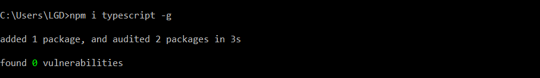
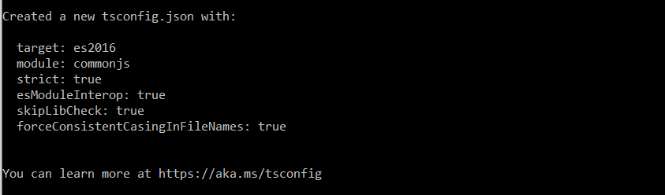
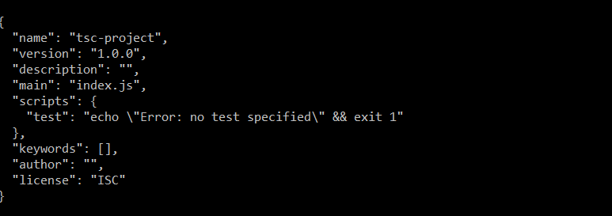
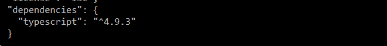
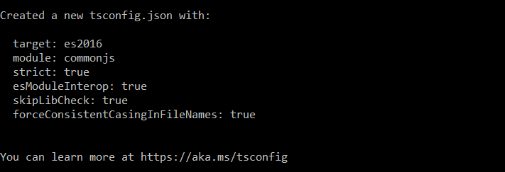
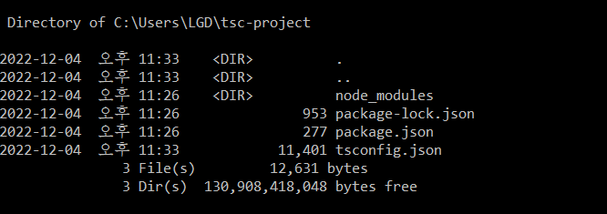

### node.js

* Chrome's
* V8 JavaScript Engine을 사용하여, 자바스크립트를 해석하고 OS 레벨에서의 API를 제공하는 서버사이드용 
* 자바스크립트 런타임 환경 


### browser

* HTML을 동적으로 만들기 위해 브라우저에서 자바스크립트를 해석하고, DOM을 제어할 수 있도록 하는 자바스크립트 런타임 환경 


### 💡 node.js 설치 

* https://nodejs.org
* node.js version manager
  * nvm 
  * n 


### 💡 npm/ visual studio plugin

* npm 
  * npm i typescript -g 
  * node_modules/.bin/tsc
  * tsc source.ts
* visual studio plugin 설치 
  * visual studio 2017/2015 update 3이후로는 디폴트로 설치되어 있다. 
  * 만약 설치가 안되어 있다면, 설치 권장 


### ✔ 간단한 컴파일러 사용 예제 

* 타입스크립트 컴파일러를 글로벌로 설치 후, 
  * cli 명령어로 파일 컴파일 
  * 특정 프로젝트 폴더에서 타입스크립트 컴파일러 설정에 맞춰 컴파일 
  * 특정 프로젝트 폴더에서 타입스크립트 컴파일러 설정에 맞춰 컴파일 (watch 모드)
* 프로젝트에 타입스크립트 컴파일러를 설치 후, 
  * .bin 안의 명령어로 파일 컴파일 
  * npm 스크립트로 파일 컴파일 
  * 프로젝트에 있는 타입스크립트 설정에 맞춰, npm 스크립트로 컴파일 
  * 프로젝트에 있는 타입스크립트 설정에 맞춰, npm 스크립트로 컴파일 (watch 모드)


```
npm i typescript -g 
```




```
nano test.ts
```

> console.log('hello');


```
tsc test.ts 
```


```
cat test.js
```

> console.log('hello');


```
mkdir tsc-project
```

```
cd tsc-project
```

```
nano test.ts
```

```
tsc --init
```




---


```
npm uninstall typescript -g 
```

```
rm -rf tsc-project
```

모두 삭제 후 다시 시작 


```
mkdir tsc-project
```

```
cd tsc-project
```

```
npm init -y
```




```
npm i typescript
```


```
type package.json
```




```
dir
```

```
dir mode_modules
```

```
dir -al node_modules
```

```
dir -al node_modules/.bin
```


(1) 

```
node_modules/.bin.tsc
```

(2) 

```
node_modules/typescript/bin/tsc
```

(3) 

```
npx tsc --init
```




```
dir
```




